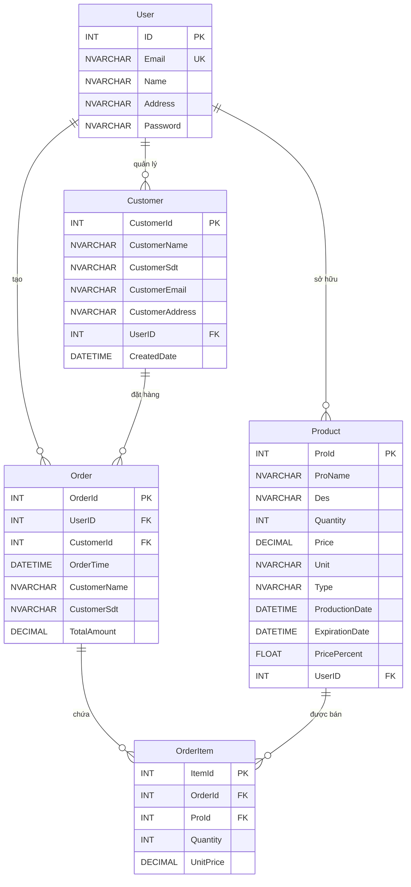

# 🌾 FarmConnect – Hệ Thống Quản Lý Bán Hàng Nông Sản

Ứng dụng **FarmConnect** là phần mềm quản lý bán hàng nông sản được xây dựng bằng **Java Swing**, phục vụ cho bài tập lớn môn **Lập trình Hướng đối tượng**.

---

## 📋 Giới thiệu

FarmConnect là ứng dụng desktop giúp người dùng quản lý toàn diện hoạt động kinh doanh nông sản, bao gồm:
- 📦 Quản lý kho hàng và sản phẩm
- 🛒 Xử lý bán hàng với giỏ hàng thông minh
- 📜 Theo dõi lịch sử giao dịch
- 📈 Phân tích thống kê doanh thu
- ⚠️ Cảnh báo sản phẩm hết hạn và tồn kho thấp

Dự án áp dụng các nguyên lý **Lập trình Hướng đối tượng (OOP)** kết hợp với giao diện **Java Swing** hiện đại và kết nối cơ sở dữ liệu **SQL Server** thông qua **JDBC**.

---

## 🎯 Mục tiêu dự án

* ✅ Áp dụng các nguyên lý OOP: đóng gói, kế thừa, đa hình, trừu tượng
* ✅ Xây dựng ứng dụng desktop hoàn chỉnh với Java Swing
* ✅ Thiết kế cơ sở dữ liệu quan hệ với nhiều bảng liên kết
* ✅ Tích hợp thư viện bên thứ ba (JFreeChart, iTextPDF)
* ✅ Tổ chức mã nguồn theo mô hình nhiều lớp (Model - DAO - Server - UI)

---

## 🛠️ Công nghệ sử dụng

| Thành phần | Công nghệ |
|------------|-----------|
| 💻 **Ngôn ngữ** | Java |
| 🖼️ **Giao diện** | Java Swing |
| 🗄️ **Cơ sở dữ liệu** | SQL Server |
| 🔗 **Kết nối CSDL** | JDBC (mssql-jdbc) |
| 📊 **Biểu đồ thống kê** | JFreeChart |
| 📄 **Xuất PDF** | iTextPDF |
| 🔧 **IDE** | IntelliJ IDEA / NetBeans |

---

## 📁 Cấu trúc thư mục

```
FarmConnect/
├── src/
│   ├── App.java              # Điểm khởi chạy chương trình
│   ├── Bill/                 # Xử lý hóa đơn
│   ├── DBConnect/            # DAO - Kết nối và truy vấn CSDL
│   │   ├── DBConnect.java    # Cấu hình kết nối database
│   │   ├── UserDAO.java      # Xử lý người dùng
│   │   ├── ProductsDAO.java  # Xử lý sản phẩm
│   │   ├── CustomerDAO.java  # Xử lý khách hàng
│   │   ├── OrderDao.java     # Xử lý đơn hàng
│   │   ├── OrderItemDao.java # Xử lý chi tiết đơn hàng
│   │   └── StatisticsDAO.java # Xử lý thống kê
│   ├── Model/                # Entity - Các lớp đối tượng
│   │   ├── User.java         # Người dùng
│   │   ├── Products.java     # Sản phẩm
│   │   ├── Customer.java     # Khách hàng
│   │   ├── Order.java        # Đơn hàng
│   │   └── OrderItem.java    # Chi tiết đơn hàng
│   ├── Server/               # Business Logic
│   │   ├── ProductsServer.java   # Logic sản phẩm
│   │   ├── OrderServer.java      # Logic đơn hàng
│   │   ├── StatisticsServer.java # Logic thống kê
│   │   └── InvoicePDFUtil.java   # Xuất hóa đơn PDF
│   ├── UI/                   # Giao diện người dùng
│   │   ├── LoginFrame.java       # Màn hình đăng nhập
│   │   ├── RegisterFrame.java    # Màn hình đăng ký
│   │   ├── MainFrame.java        # Khung chính (menu điều hướng)
│   │   ├── DashboardPanel.java   # Trang tổng quan
│   │   ├── ProductListPanel.java # Danh sách sản phẩm
│   │   ├── CartPanel.java        # Giỏ hàng
│   │   ├── HistoryPanel.java     # Lịch sử bán hàng
│   │   ├── StatisticsPanel.java  # Thống kê & biểu đồ
│   │   ├── UIStyle.java          # Hệ thống thiết kế UI
│   │   └── ...                   # Các form nhập liệu
│   └── Image/                # Hình ảnh, icon
├── database/
│   ├── 01_create_database.sql # Script tạo CSDL và bảng
│   └── 02_insert_data.sql     # Script thêm dữ liệu mẫu
├── lib/                      # Thư viện JAR
│   ├── mssql-jdbc-13.2.1.jre11.jar
│   ├── jfreechart-1.0.19.jar
│   ├── jcommon-1.0.23.jar
│   └── itextpdf-5.5.13.4.jar
└── README.md
```

---

## ⚡ Chức năng chính

### 🔐 Đăng nhập & Đăng ký
- Xác thực người dùng với email và mật khẩu
- Đăng ký tài khoản mới
- Mỗi người dùng có dữ liệu riêng biệt

### 📊 Dashboard (Trang tổng quan)
- Hiển thị các số liệu quan trọng (tổng sản phẩm, doanh thu ngày, số đơn hàng)
- Cảnh báo sản phẩm sắp hết hạn (màu vàng) và đã hết hạn (màu đỏ)
- Bảng chi tiết sản phẩm hết hạn/sắp hết hạn

### 📦 Quản lý sản phẩm
- **Thêm sản phẩm**: Nhập đầy đủ thông tin (tên, mô tả, số lượng, giá, đơn vị, loại, ngày sản xuất, hạn sử dụng)
- **Sửa sản phẩm**: Cập nhật thông tin sản phẩm đã có
- **Tìm kiếm và lọc**: Theo tên, loại sản phẩm, sắp xếp theo nhiều tiêu chí

### 🛒 Giỏ hàng & Bán hàng
- Thêm nhiều sản phẩm vào giỏ hàng
- Chọn khách hàng hoặc thêm khách hàng mới
- Tính tổng tiền tự động
- Xác nhận thanh toán và lưu đơn hàng

### 📜 Lịch sử bán hàng
- Xem danh sách tất cả đơn hàng đã bán
- Giao diện Master-Detail: Chọn đơn hàng để xem chi tiết
- Hiển thị thông tin khách hàng, tổng tiền
- Xuất hóa đơn PDF cho từng đơn hàng

### 📈 Thống kê & Báo cáo
- **Biểu đồ doanh thu 7 ngày**: Theo dõi xu hướng bán hàng
- **Top 5 sản phẩm bán chạy**: Biểu đồ cột
- **Phân bố sản phẩm theo loại**: Biểu đồ tròn
- **Top khách hàng**: Theo doanh thu

### 🧾 Xuất hóa đơn PDF
- Tạo hóa đơn PDF chuyên nghiệp
- Bao gồm chi tiết sản phẩm, số lượng, đơn giá, thành tiền
- Định dạng tiền tệ Việt Nam

---

## 🗄️ Cơ sở dữ liệu

### Sơ đồ quan hệ (ERD)



### Quan hệ giữa các bảng

```
                                    ┌─────────────────┐
                                    │      User       │
                                    │  (Người dùng)   │
                                    └────────┬────────┘
                                             │
              ┌──────────────────────────────┼──────────────────────────────┐
              │                              │                              │
              ▼                              ▼                              ▼
    ┌─────────────────┐            ┌─────────────────┐            ┌─────────────────┐
    │    Customer     │            │     Product     │            │      Order      │
    │  (Khách hàng)   │            │   (Sản phẩm)    │            │   (Đơn hàng)    │
    └────────┬────────┘            └────────┬────────┘            └────────┬────────┘
             │                              │                              │
             │                              │                              │
             └──────────────┬───────────────┘                              │
                            │                                              │
                            │         ┌────────────────────────────────────┘
                            │         │
                            ▼         ▼
                    ┌─────────────────────┐
                    │     OrderItem       │
                    │ (Chi tiết đơn hàng) │
                    └─────────────────────┘
```

**Mô tả quan hệ:**
- 👤 **User → Customer**: Một người dùng có thể quản lý nhiều khách hàng (1:N)
- 👤 **User → Product**: Một người dùng có thể sở hữu nhiều sản phẩm (1:N)  
- 👤 **User → Order**: Một người dùng có thể tạo nhiều đơn hàng (1:N)
- 🧑‍🤝‍🧑 **Customer → Order**: Một khách hàng có thể có nhiều đơn hàng (1:N)
- 📋 **Order → OrderItem**: Một đơn hàng chứa nhiều chi tiết sản phẩm (1:N)
- 📦 **Product → OrderItem**: Một sản phẩm có thể xuất hiện trong nhiều chi tiết đơn hàng (1:N)

---

## 🚀 Hướng dẫn cài đặt và chạy

### Yêu cầu hệ thống
- ☕ **JDK 11** hoặc cao hơn
- 🗃️ **SQL Server** (hoặc SQL Server Express)
- 💻 **IDE**: IntelliJ IDEA / NetBeans / Eclipse

### Các bước thực hiện

1. **Clone repository**
   ```bash
   git clone https://github.com/yourusername/FarmConnect.git
   ```

2. **Tạo cơ sở dữ liệu**
   - Mở SQL Server Management Studio
   - Chạy file `database/01_create_database.sql` để tạo database và các bảng
   - Chạy file `database/02_insert_data.sql` để thêm dữ liệu mẫu

3. **Cấu hình kết nối database**
   - Mở file `src/DBConnect/DBConnect.java`
   - Chỉnh sửa thông tin kết nối (server, port, database name)
   ```java
   String url = "jdbc:sqlserver://localhost:1433;databaseName=FarmConnect;...";
   ```

4. **Import project vào IDE**
   - Thêm tất cả file JAR trong thư mục `lib/` vào classpath

5. **Chạy chương trình**
   - Chạy file `src/App.java`
   - Đăng nhập với tài khoản mẫu hoặc đăng ký tài khoản mới

---

## 📸 Ảnh chụp màn hình

### 1. Màn hình đăng nhập


### 2. Màn hình đăng ký


### 3. Dashboard - Trang tổng quan


### 4. Quản lý sản phẩm


### 5. Giỏ hàng


### 6. Lịch sử bán hàng


### 7. Thống kê & Biểu đồ


### 8. Xuất hóa đơn PDF


---

## 🔮 Hướng phát triển

- [ ] 📅 Thêm chức năng báo cáo theo tháng/quý/năm
- [ ] 📊 Xuất báo cáo Excel
- [ ] 🔖 Tích hợp barcode/QR code cho sản phẩm
- [ ] 📥 Thêm chức năng nhập kho
- [ ] 👥 Phân quyền người dùng (Admin/Staff)
- [ ] 💾 Backup và restore dữ liệu
- [ ] 🌐 Chuyển sang JavaFX hoặc phát triển phiên bản Web

---

## 👨‍💻 Thông tin tác giả

| Thông tin | Chi tiết |
|-----------|----------|
| 🎓 **Sinh viên** | Hà Văn Phong |
| 📚 **Môn học** | Lập trình Hướng đối tượng |
| 💻 **Ngôn ngữ** | Java |
| 🛠️ **Framework** | Java Swing + JDBC |

---

## 📄 License

Dự án này được phát triển cho mục đích học tập.

---

<p align="center">
  <b>🌾 FarmConnect - Giải pháp quản lý nông sản thông minh 🌾</b>
</p>
